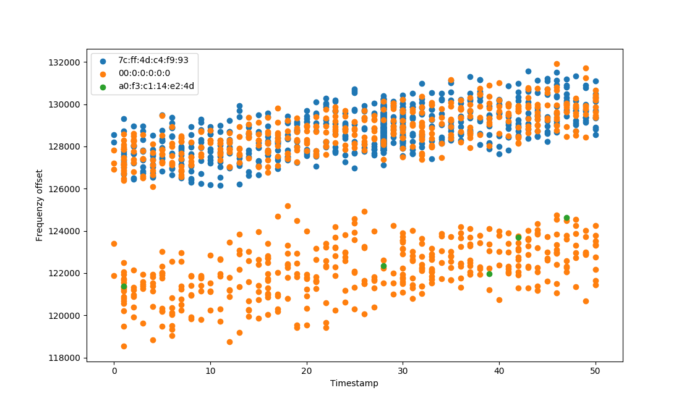

* Requirements: Installation of `docker` and `gnuradio (maint-3.8)`   

## Installation of gr-ieee802-11
In order to install the additional gnuradio block developed for this lap the branch must be changed to `meta_data_analyzing` (`git checkout meta_data_analyzing`). Afterwards the installation can take place as described in `gr-ieee802-11\README.md`. The gnuradio-companion should now contain a block named `WiFi Parse Meta Mac`.

## Installation of MySQL Database
The mysql Database, in which the meta data of each MAC-frame will be stored, is deployed via docker. To get the mysql docker container up and running the following commands need to be executed as root.
```
docker pull mysql:latest   
docker run --name meta_analyzer_db -d -p 3306:3306 -e MYSQL_ROOT_PASSWORD=123  mysql:latest
```

## UDP Receiver
* Requirements: Pip installation of `mysql-connector-python`   
    
With `gr-ieee802-11/experiment/udp_receiver.py` a python script is provided which receives the udp-packages published by the gnuradio flow graph. (either wifi_loopback or wifi_rx) The received data is pared and saved in the database running in the docker container. By default the UDP Server is bind to 127.0.0.1:52002 but a different interface IP and Port number can be provided as arguments. For example, to receive data from another interface than the loopback.

## Query Visualizer
* Requirements: Pip installation of `matplotlib` and `mysql-connector-python` 
     
The python script `gr-ieee802-11/experiment/query_visualizer.py` provides a first visualization of the gathered data. Each package is represented as a point, while its color stands for a specific sender mac-address. The y-axes represents the frequency-offset and the x-axes the seconds elapsed since the beginning of the recording.   
The following figure is a test-record of a wireless network used by two devices, the orange points a probably caused by an error occurring while decoding the sender mac-address. But it can be seen that the offsets produced by the two devices are separated into two stripes.

